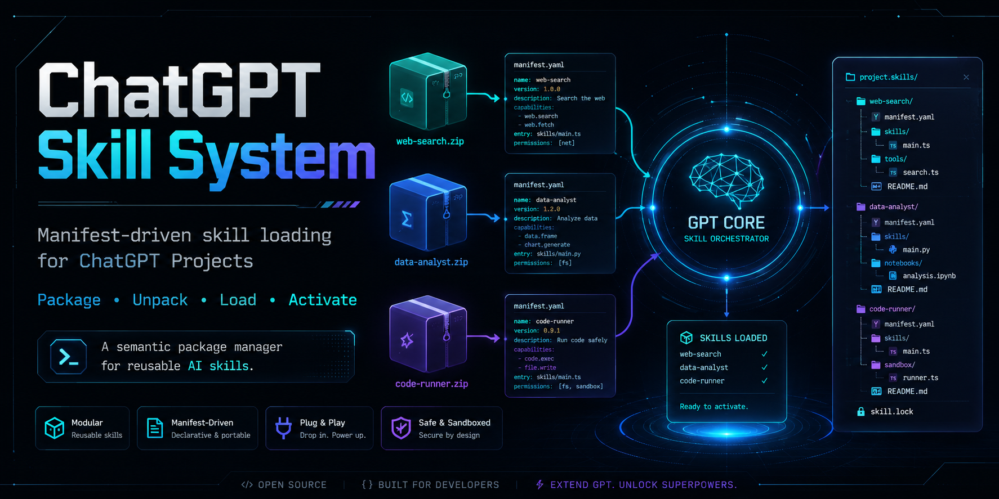

<p align="center">
  
</p>

# 🧠 GPT Project Skill System

> A small system for loading skills from packages in ChatGPT Projects.

GPT Project Skill System brings a skill-package workflow to ChatGPT Projects.

It lets you package reusable skills as ZIP files, upload them to a Project, unpack them into `/mnt`, and load them into the current session with explicit commands.

A skill package can include instructions, support files, local scripts, and assets.

A skill is not active just because its ZIP file is present in the Project. It becomes active only after it is explicitly unpacked and loaded.

---

## 🎯 What this is for

ChatGPT Projects can use uploaded files as working context, but they do not provide a native skill-package workflow.

This project adds that workflow.

It gives you a way to bring reusable skills into a ChatGPT Project as packages instead of copying instructions by hand every time.

The system is built around three simple ideas:

- 📦 package a skill as a ZIP file;
- 📂 unpack it into the Project runtime environment;
- 🧠 load its declared instructions into the current session only when you choose to use it.

A skill can carry more than one file.

It can include:

- 📝 instruction files;
- 📚 support/reference files;
- 🛠️ local Python-compatible tool scripts;
- 🧱 assets, templates, examples, or other files.

Only files declared in `load_sequence` are mounted as active skill instructions.

Other files can be physically available after unpack, but they are not automatically treated as active context.

---
## 🚀 Use now

1. Add `dist/GPT.SKILLS.zip` to your ChatGPT Project.

2. Add `CUSTOM_INSTRUCTIONS.txt` to the Project instructions.

3. Add the skill ZIPs you want to use, for example `dist/skills/skill-adapter.zip`.

4. Start a new chat in the Project.

5. Ask to unpack and load the skill you need:

> Unpack the skill-adapter skill.

> Load the skill-adapter skill.

You can also use:

- `SKILL skill-adapter UNPACK`
- `SKILL skill-adapter LOAD`

---

## 🛠️ Included skill: skill-adapter

`skill-adapter` helps inspect external skill ZIP files before adapting them to this system.

It reports whether a candidate skill package looks compatible, blocked, or recoverable.

It can point out packaging problems such as wrapper folders, unsafe paths, missing declared files, or invalid mounted files.

It does not silently convert packages.

It does not auto-install anything.

It does not run external tools automatically.

---

## 🚫 What this does not do

This system does not provide:

- ❌ permanent skill installation;
- ❌ automatic skill discovery;
- ❌ automatic skill loading;
- ❌ automatic routing;
- ❌ hooks;
- ❌ watchers;
- ❌ daemons;
- ❌ dependency installation;
- ❌ marketplace behavior;
- ❌ persistent runtime state.

The active skill set exists only inside the current chat session.

---

## 📚 Documentation

- 📘 `docs/SKILL_PACKAGE_FORMAT.md` — supported skill package shapes
- 🧰 `docs/ADAPTING_A_SKILL.md` — how to adapt external skills
- 📦 `docs/PACKAGING.md` — how to build the runtime ZIP correctly

---

## 🤖 AI-assisted development

This project was developed with AI assistance.

The project, documentation, and repository materials were shaped through human-directed work supported by AI tools during drafting, structuring, review, and refinement.

AI assistance does not make the project automatically correct, complete, or suitable for every use case. Read it, test it, and adapt it to your own context.

---

## 📜 License

This project is licensed under CC BY-SA 4.0: Creative Commons Attribution-ShareAlike 4.0 International.

See `LICENSE`.

---

<details>
<summary>🧪 Technical / maintainer details</summary>

## 🗂️ Repository layout

```text
GPT.SKILLS/
  SYSTEM_CORE/
  SKILLS/

skill_sources/
  skill-adapter/

dist/
  GPT.SKILLS.zip
  skills/
    skill-adapter.zip

docs/
  ADAPTING_A_SKILL.md
  PACKAGING.md
  SKILL_PACKAGE_FORMAT.md

scripts/
  build_packages.py
```

---

## 🧩 Core package shape

`dist/GPT.SKILLS.zip` must contain this root shape:

```text
SYSTEM_CORE/
SKILLS/
```

It must not contain a wrapper folder like this:

```text
GPT.SKILLS/
  SYSTEM_CORE/
  SKILLS/
```

The core unpack target is:

```text
/mnt/data/GPT.SKILLS/
```

If the ZIP contains a `GPT.SKILLS/` wrapper folder, the extracted tree becomes invalid:

```text
/mnt/data/GPT.SKILLS/GPT.SKILLS/SYSTEM_CORE/
```

---

## 🧠 Skill package modes

There are two supported skill package modes.

### 🟦 Fallback Skill

Use this when the skill entry point is root `SKILL.md`.

```text
skill.zip
  MANIFEST.json
  SKILL.md
```

Minimal manifest:

```json
{
  "skill_name": "example",
  "version": "1.0"
}
```

The loader uses:

```json
{
  "primary_file": "SKILL.md",
  "load_sequence": ["SKILL.md"]
}
```

### 🟩 Explicit Manifest Skill

Use this when the skill needs a declared entry point, preserved folders, support files, scripts, or assets.

```text
skill.zip
  MANIFEST.json
  any/safe/path/SKILL.md
  docs/
  tools/
  templates/
```

Example:

```json
{
  "skill_name": "example",
  "version": "1.0",
  "primary_file": "any/safe/path/SKILL.md",
  "load_sequence": ["any/safe/path/SKILL.md"],
  "support_files": ["docs/reference.md"],
  "tool_files": ["tools/helper.py"],
  "asset_files": ["templates/template.csv"]
}
```

Only files in `load_sequence` are mounted semantically.

`support_files`, `tool_files`, and `asset_files` are physically available after unpack, but they are not active context automatically.

---

## 🏗️ Build

Run:

```bash
python scripts/build_packages.py
```

The build writes:

```text
dist/GPT.SKILLS.zip
dist/skills/*.zip
```

The builder validates:

- 📦 package shape;
- 🧭 ZIP paths;
- 🧾 manifests;
- 🧠 load files;
- 🗂️ declared support files;
- 🛠️ declared tool files;
- 🧱 declared asset files;
- 🚫 wrapper errors;
- 🚫 unsafe paths.

---

## 🧭 Path and ZIP rules

Package ZIP entries must use POSIX `/` separators.

Invalid:

```text
SYSTEM_CORE\MANIFEST.json
```

Valid:

```text
SYSTEM_CORE/MANIFEST.json
```

Skill package paths must be safe relative paths:

- no absolute paths;
- no `..`;
- no backslashes;
- no drive letters;
- no empty path segments;
- no single wrapper directory as ZIP root.

---

## 🔒 Runtime boundary

The core package and skill packages are separate.

`SKILL CORE UNPACK` targets only `GPT.SKILLS.zip`.

It must not inspect, unpack, validate, load, compile, or activate skill packages.

Skill ZIP files present among Project sources are inert until an explicit `SKILL <name> UNPACK`.


</details>
